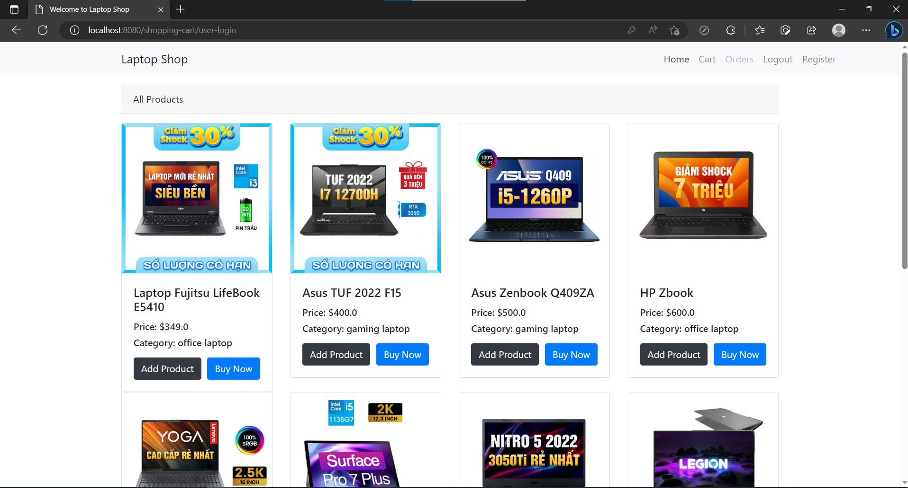

# Laptop Shop
---
Fronted: HTML,CSS,Boostrap
Backend: Servlet, Mysql

# Ảnh chụp màn hình và mô tả chức năng

----
- Ban đầu người dùng vào web cần phải đăng ký thành viên

- Sau khi đăng ký thành viên người dùng sẽ login vào hệ thống

- Sau khi login vào hệ thống thì trang home hiển thị toàn bộ sản phẩm của shop sẽ hiển thị

- Khi người dùng click vào Add Product sản phẩm sẽ được thêm vào giỏ hàng. Trong trang Cart sẽ hiển thị toàn bộ các sản phẩm mà khách hàng đã chọn

- Người dùng có thể tăng giảm số lượng sản phẩm trong giỏ hàng

- Trong trang Order sẽ có hóa đơn toàn bộ thông tin sản phẩm khách hàng đã chọn mua. Button Cacel Order cho phép khách hàng xóa 1 sản phẩm trong đơn

# Mô hình MVC

# View
- Chứa các file html,css,jsp,boostrap để hiển thị phía người dùng

# Model

- Chứa thông tin của các entities.

- Kết nối với Mysql

- Thực hiện các chuỗi login phía database

# Controller: Kết nối giữa tầng Model và tầng View
- Xử lý các logic từ tầng Model chuyển đến

